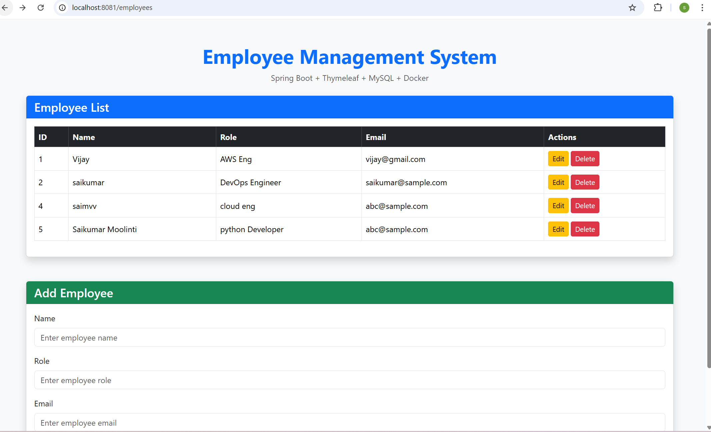
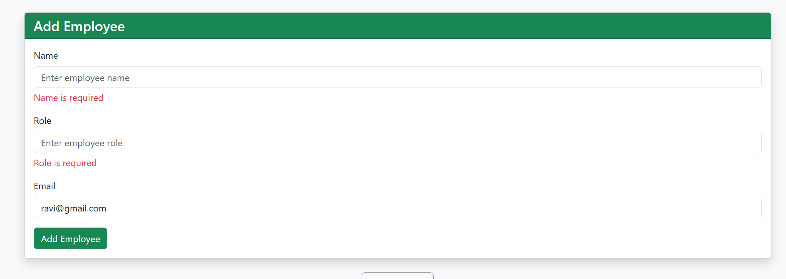
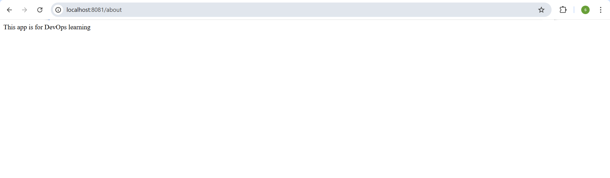
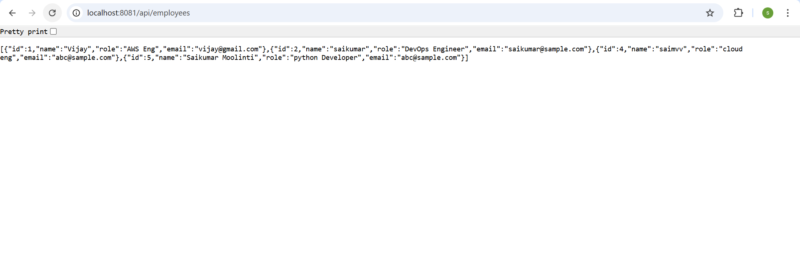

# Employee Management System

A simple full-stack Employee Management System built using **Spring Boot**, **Thymeleaf**, **MySQL**, and **Docker**.

## Features

- View employee list
- Add new employee
- Edit employee details
- Delete employee
- Form validation
- MySQL database integration
- Docker support

## Tech Stack

- Java 17
- Spring Boot
- Spring MVC
- Spring Data JPA
- Thymeleaf
- MySQL
- Docker
- Maven
- HTML/CSS/Bootstrap

## Project Structure

## Project Structure

```text
employee-management-system/
├── src/
│   └── main/
│       ├── java/
│       └── resources/
│           ├── templates/
│           └── application.properties
├── ScreenShots/
├── Dockerfile
├── docker-compose.yml
├── pom.xml
└── README.md
## Screenshots

### Home / Employee List


### Add Employee Validation


### About Page


### Employee API Output
## Run Locally

### 1. Clone the repository
```bash
git clone https://github.com/saimvv6/employee-management-system.git
cd employee-management-system
```

### 2. Create MySQL database
```sql
CREATE DATABASE employee_db;
```

### 3. Update application.properties
```properties
spring.datasource.url=jdbc:mysql://localhost:3306/employee_db
spring.datasource.username=root
spring.datasource.password=root
spring.jpa.hibernate.ddl-auto=update
server.port=8081
```

### 4. Run the project
```bash
mvn spring-boot:run
```

### 5. Open in browser
```bash
http://localhost:8081/employees
```

## Docker Run

```md
## Run with Docker

```bash
docker-compose up --build
## Author

**Saikumar**  
GitHub: [saimvv6](https://github.com/saimvv6)
